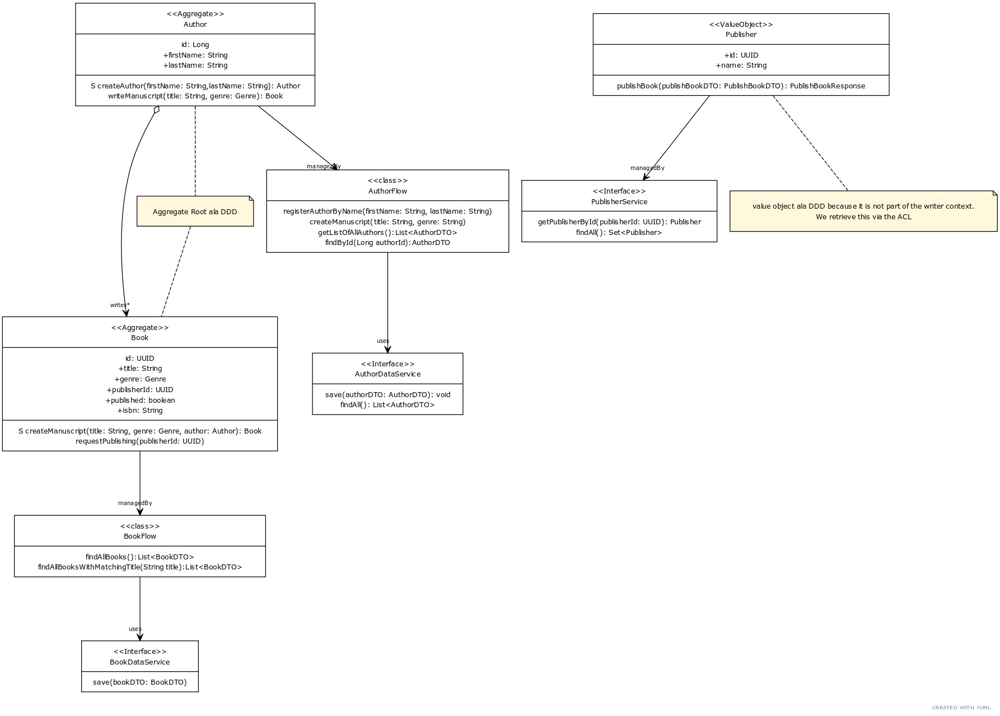

# 4: Hands-On - The domain
The base application we will be working with during this mini lab is a simple service, where one can register book 
authors, let them write books and eventually publish them. The publishers will not be part of our bounded context 
though. The app needs to retrieve any information about them from an [external publisher API](https://github.com/MaikKingma/publisher-service).

In our domain model we have identified two aggregates: Author and Book.
A publisher is information from another bounded context. It might change over time, and we have no control over it as such. 
That is why we make it an immutable value object in our context, that is not persisted to our database. The only 
thing we need to know from a publisher, is the identifier of the publisher. We will need it in order to identify the 
publisher of a book.

### Domain Diagram


### The API

```
POST /authors/commands/register
POST /authors/{id}/commands/writeBook
GET /authors

GET /books?title
POST /books/{id}/commands/publish
```

You can find the http files in the `http` folder in the root of this project.

If there are any questions about the domain model or the API definition feel free to ask.


