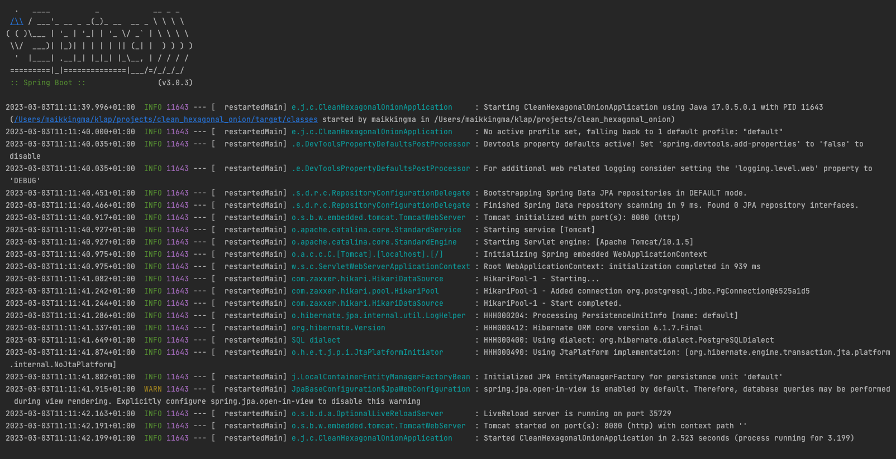

# 5: Hands-On - Set up the Application

### Timebox: 15 minutes

## Get the base application
Setting up the project from scratch would take up too much time and focus away from the important content of this 
mini lab. Hence, I took the liberty of preparing a repository that you can fork or clone.

There is a button to GitHub located in the header menu. Alternatively, click 
[here](https://github.com/MaikKingma/tackle-eventual-consistency-with-domain-events/tree/get-started).

```git checkout get-started```

## Get the publisher service
In order to be able to publish a book, we need a publisher. For that purpose, we will use a simple publisher service
Check out the repository [here](https://github.com/MaikKingma/publisher-service).

In the root directory of the publisher service, run

```bash
mvn clean spring-boot:run
```

The application we will be building throughout this workshop is configured to run against the publisher service running 
on your local machine on http://localhost:8081.

## Validate
In order to be able to start our application we need a DB at our disposal. For that purpose, run the docker-compose 
script from the IDE (little green play button in IntelliJ) or from the terminal with ``docker compose up --build``.

> **Note:** You will have to enable annotation processing in your IDE.

Validate that the Spring applications starts by running the application (without any errors).
The log output will look something like this:


All green? Well done! We are now ready to move on to the next chapter.

